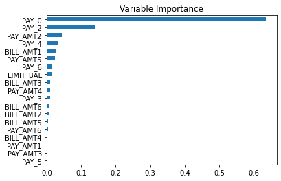

# DNSC-6301-Group-16
DNSC 6301 Group Project - Group 16
# Credit Line Increase Model Card

### Basic Information

* **Person or organization developing model**: Zhipeng Zhao, `micheal@gmail.com`, Bagya Widanagamage, `bagya@gmail.com`, Chao Zhang, `chao@gmail.com`
* **Model date**: August, 2022
* **Model version**: 1.0
* **License**: MIT
* **Model implementation code**: [DNSC_6301_Example_Project.ipynb](https://github.com/jphall663/GWU_DNSC_6301_project/blob/main/DNSC_6301_Example_Project.ipynb)

### Intended Use
* **Primary intended uses**: This is an example use case with the intend to be used for determining eligibility for a credit line increase. This model uses probability of default classifier model. 
* **Primary intended users**: Students in GWU DNSC 6301 bootcamp.
* **Out-of-scope use cases**: Any use beyond an educational example is out-of-scope.

### Training Data

* Data dictionary: 

| Name | Modeling Role | Measurement Level| Description|
| ---- | ------------- | ---------------- | ---------- |
|**ID**| ID | int | unique row indentifier |
| **LIMIT_BAL** | input | float | amount of previously awarded credit |
| **SEX** | demographic information | int | 1 = male; 2 = female
| **RACE** | demographic information | int | 1 = hispanic; 2 = black; 3 = white; 4 = asian |
| **EDUCATION** | demographic information | int | 1 = graduate school; 2 = university; 3 = high school; 4 = others |
| **MARRIAGE** | demographic information | int | 1 = married; 2 = single; 3 = others |
| **AGE** | demographic information | int | age in years |
| **PAY_0, PAY_2 - PAY_6** | inputs | int | history of past payment; PAY_0 = the repayment status in September, 2005; PAY_2 = the repayment status in August, 2005; ...; PAY_6 = the repayment status in April, 2005. The measurement scale for the repayment status is: -1 = pay duly; 1 = payment delay for one month; 2 = payment delay for two months; ...; 8 = payment delay for eight months; 9 = payment delay for nine months and above |
| **BILL_AMT1 - BILL_AMT6** | inputs | float | amount of bill statement; BILL_AMNT1 = amount of bill statement in September, 2005; BILL_AMT2 = amount of bill statement in August, 2005; ...; BILL_AMT6 = amount of bill statement in April, 2005 |
| **PAY_AMT1 - PAY_AMT6** | inputs | float | amount of previous payment; PAY_AMT1 = amount paid in September, 2005; PAY_AMT2 = amount paid in August, 2005; ...; PAY_AMT6 = amount paid in April, 2005 |
| **DELINQ_NEXT**| target | int | whether a customer's next payment is delinquent (late), 1 = late; 0 = on-time |

* **Source of training data**: GWU Blackboard Electronic Reserves
* **How training data was divided into training and validation data**: 25% validation, 25% training
* **Number of rows in training and validation data**:
  * Training data: 15000 rows 
  * Validation data: 7500 rows 

### Test Data
* **Source of test data**: GWU Blackboard Electronic Reserves
* **Number of rows in test data**: 7,500
* **State any differences in columns between training and test data**: None

### Model details
* **Columns used as inputs in the final model**:  'LIMIT_BAL', 'PAY_0', 'PAY_2', 'PAY_3', 'PAY_4', 'PAY_5', 'PAY_6', 'BILL_AMT1', 'BILL_AMT2', 'BILL_AMT3', 'BILL_AMT4', 'BILL_AMT5', 'BILL_AMT6', 'PAY_AMT1', 'PAY_AMT2', 'PAY_AMT3', 'PAY_AMT4', 'PAY_AMT5', 'PAY_AMT6'

* **Column(s) used as target(s) in the final model**: 'DELINQ_NEXT'
* **Type of model**:  Decision Tree Classification
* **Software used to implement the model**: Python, scikit-learn
* **Version of the modeling software**:  
  * Python version: 3.7.13 
  * sklearn version: 1.0.2

* **Hyperparameters or other settings of your model**: 
```
DecisionTreeClassifier(max_depth = depth + 1, random_state=SEED)
```
### Quantitative Analysis

| Trainig AUC | Validation AUC | Testing AUC |
| ------ | ------- | -------- |
| 0.783722 | 0749610  | 0.7438 |

| Hispanic -to-White AIR | Black-to-White AIR | Asian-to-White AIR | Female-to-White AIR |
| ------ | ------ | ------ | ------ |
| 0.833205 | 0.85 | 1.00 | 1.02 |

#### Correlation Heatmap





